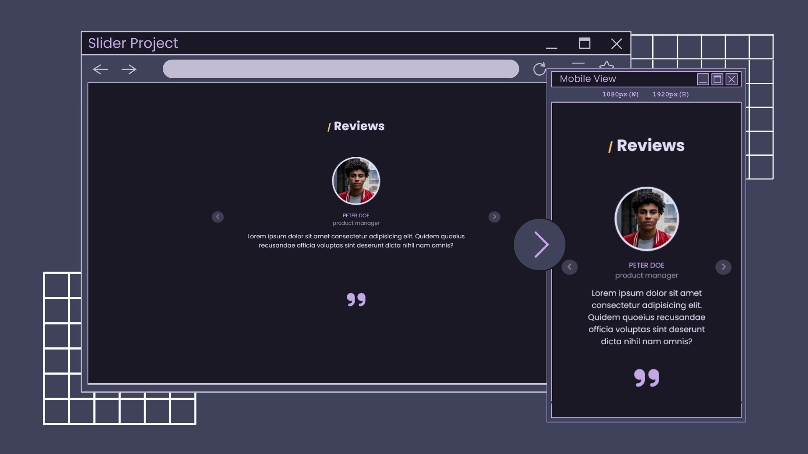

# Slider

This is a solution for John Smilga's [Slider Project](https://vannilla-js-basic-project-25-es6-slider.netlify.app/) which is part of his [Javascript Tutorial and Projects Course](https://www.udemy.com/course/javascript-tutorial-for-beginners-w/?referralCode=DD9FA6C0D976918D3E1C) on Udemy.

 

## Table of contents

- [Overview](#overview)
  - [The challenge](#the-challenge)
  - [Screenshot](#screenshot)
  - [Links](#links)
- [My process](#my-process)
  - [Built with](#built-with)
  - [What I learned](#what-i-learned)
  - [Continued development](#continued-development)
  - [Useful resources](#useful-resources)
- [Author](#author)
- [Acknowledgments](#acknowledgments)

## Overview

### The challenge

Users should be able to:

- View the optimal layout for the app depending on their device's screen size
- See hover states for all interactive elements on the page
- View the previous and next review when they click the previous and next button

### Screenshot



### Links

- Solution URL: [https://github.com/ereljapco/mini-projects/tree/main/26-slider](https://github.com/ereljapco/mini-projects/tree/main/26-slider)
- Live Site URL: [https://slider-erj.netlify.app/](https://slider-erj.netlify.app/)

## My process

### Built with

- Mobile-first workflow
- Semantic HTML5 markup
- CSS custom properties
- Flexbox
- CSS Grid
- BEM
- Vanilla JS

### What I learned

- Using default actions to simplify the code
  - This can either be helpful or not depending on use.

```js
reviewsPrevBtn.addEventListener('click', () => {
  slideReviews('prev');
});

reviewsNextBtn.addEventListener('click', () => {
  slideReviews();
});
```

### Continued development

I will be doing FrontendMentor's [Coding Bootcamp Testimonials Sldier](https://www.frontendmentor.io/challenges/coding-bootcamp-testimonials-slider-4FNyLA8JL) to practice what I learned here on this course and, of course, to practice HTML and CSS, as well.

### Useful resources

- [Rose Pine Theme](https://rosepinetheme.com/) - Used their palette for this project.
- [John Smilga's JS Course](https://www.udemy.com/course/javascript-tutorial-for-beginners-w/?referralCode=DD9FA6C0D976918D3E1C) - A project-based course that helped me understood Vanilla JS.

## Author

- Website - [Erel Japco](https://github.com/ereljapco)
- LinkedIn - [Erel Japco](https://www.linkedin.com/in/ereljapco/)
- Frontend Mentor - [@ereljapco](https://www.frontendmentor.io/profile/ereljapco)

## Acknowledgments

Great thanks for John Smilga for creating his JS course. He taught JS in a repetitive application of the topics throughout his many projects. I recommend his course if want to learn JS.
